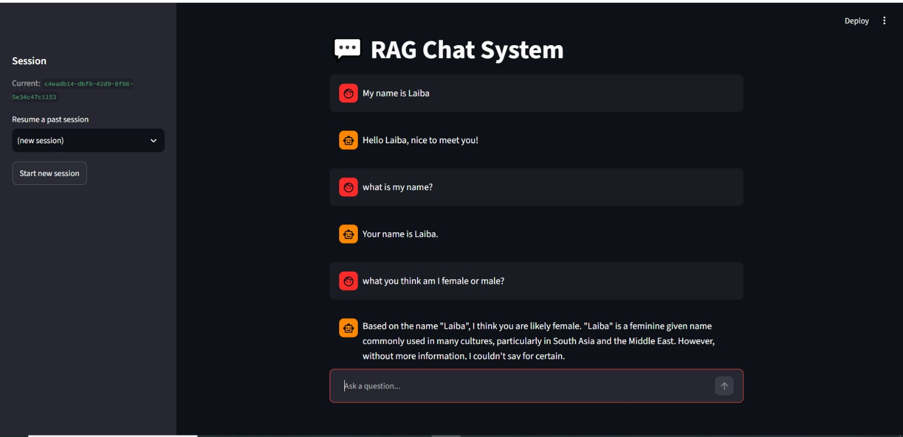
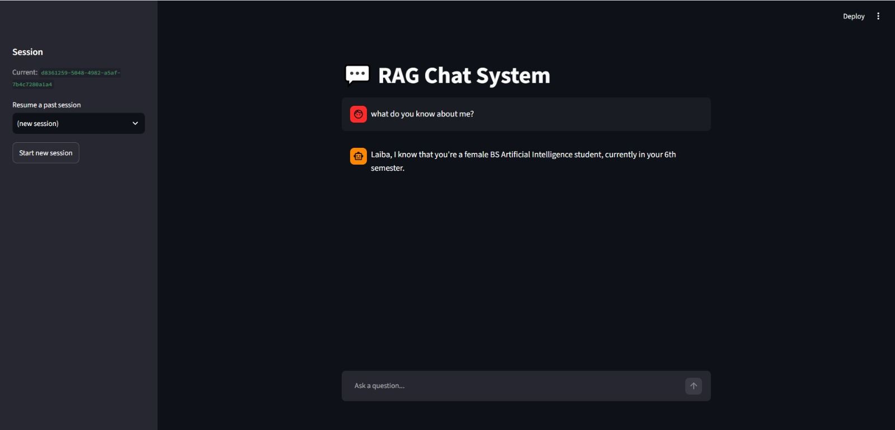

# RAG Chat System

A Retrieval-Augmented Generation (RAG) chat application that answers questions using both your own documents and general knowledge, while maintaining persistent conversation memory across sessions - including permanent facts about the user, recalled automatically in brand-new chats.

## Features

- **Chat Interface** - Interactive chat UI built with Streamlit
- **RAG Pipeline** - Retrieves relevant context from your documents before generating answers
- **Persistent Memory** - Chat history is stored in SQLite and reused within and across sessions
- **Cross-Session Fact Memory** - Automatically detects and permanently remembers personal facts (name, field of study, etc.) shared by the user, and recalls them in any future session, even a brand-new one - similar to ChatGPT's memory feature
- **Session Resume** - Pick up a previous conversation from the sidebar, even after restarting the app
- **Fast LLM Inference** - Uses Groq's API (Llama 3.3 70B) for high-quality, low-latency responses

## Tech Stack

| Component        | Technology                          |
|-------------------|--------------------------------------|
| Backend API       | FastAPI                             |
| Frontend UI       | Streamlit                           |
| Vector Database   | ChromaDB                            |
| Embeddings        | sentence-transformers (all-MiniLM-L6-v2) |
| Chat History      | SQLite                              |
| LLM               | Groq API (llama-3.3-70b-versatile)  |

## Project Structure

```
rag-chat-system/
+-- app/
|   +-- config.py          # Central configuration (paths, model names, chunk settings)
|   +-- embeddings.py       # Converts text into vector embeddings
|   +-- vector_store.py     # ChromaDB wrapper for storing/retrieving document chunks
|   +-- history.py          # SQLite wrapper for chat history and permanent fact memory
|   +-- llm.py               # Groq API client for generating responses
|   +-- rag_pipeline.py     # Combines retrieval + history + fact memory + generation
|   +-- main.py              # FastAPI backend exposing /chat, /sessions, /history endpoints
+-- ui/
|   +-- streamlit_app.py    # Chat interface with session resume support
+-- data/                    # Source documents to be ingested (.txt files)
+-- storage/                 # Auto-generated: ChromaDB + SQLite database files
+-- screenshots/              # App screenshots used in this README
+-- ingest.py                 # Script to chunk and embed documents into the vector store
+-- requirements.txt
+-- .env                       # API keys (not committed to Git)
+-- README.md
```

## How the RAG System Works

1. **Ingestion** (`ingest.py`) - Documents in `data/` are split into overlapping text chunks, converted into vector embeddings using a sentence-transformer model, and stored in a persistent ChromaDB collection.

2. **Retrieval** - When a user sends a message, the same embedding model converts the question into a vector, and ChromaDB returns the most semantically similar document chunks.

3. **Augmentation** - The retrieved chunks are combined with recent conversation history (pulled from SQLite) and any permanently stored facts about the user into a single prompt. If no relevant document chunks are found, the system relies on the LLM's own general knowledge instead.

4. **Generation** - The combined prompt is sent to Groq's `llama-3.3-70b-versatile` model, which generates a context-aware answer.

5. **Memory** - Both the user's message and the assistant's answer are saved to SQLite under a session ID, so the assistant can recall facts stated earlier in the current conversation.

6. **Permanent Fact Memory** - After every user message, a second lightweight LLM call checks whether the message contains a personal fact (name, field of study, preferences, etc.). If found, it is saved permanently in a separate `memory_facts` table. Every future prompt, in any session, always includes the full list of known facts - meaning the assistant remembers who you are even in a completely new chat with no shared session ID.

## API Endpoints

| Method | Endpoint                  | Description                                      |
|--------|----------------------------|---------------------------------------------------|
| POST   | `/chat`                    | Send a message, get a RAG-generated answer        |
| GET    | `/sessions`                 | List all past session IDs, most recent first      |
| GET    | `/history/{session_id}`    | Retrieve the full message history for a session   |
| GET    | `/`                          | Health check - confirms the API is running        |

## Setup Instructions (Windows / PowerShell)

### 1. Clone the repository

```powershell
git clone https://github.com/LaibaMurtaza-21/rag-chat-system.git
cd rag-chat-system
```

### 2. Create a virtual environment

```powershell
python -m venv venv
.\venv\Scripts\Activate.ps1
```

> If PowerShell blocks the script with an execution policy error, run this once, then re-activate:
> ```powershell
> Set-ExecutionPolicy -Scope Process -ExecutionPolicy RemoteSigned
> ```

### 3. Install dependencies

```powershell
pip install -r requirements.txt
```

### 4. Configure your API key

Create a `.env` file in the project root:

```
GROQ_API_KEY=your_groq_api_key_here
```

Get a free API key at [console.groq.com](https://console.groq.com) (no credit card required).

### 5. Add documents and ingest them

Place `.txt` files in the `data/` folder, then run:

```powershell
python ingest.py
```

### 6. Start the backend

```powershell
uvicorn app.main:app --reload
```

### 7. Start the frontend (in a separate PowerShell terminal)

```powershell
.\venv\Scripts\Activate.ps1
streamlit run ui/streamlit_app.py
```

> Both the backend (step 6) and frontend (step 7) must be running **at the same time**, in two separate terminals. The chat interface will open at `http://localhost:8501`.

## Using Session Resume

1. Ask a question in the chat - it's automatically saved under your current session ID (shown in the sidebar).
2. Click **"Start new session"** to begin a fresh conversation.
3. In the sidebar, use the **"Resume a past session"** dropdown to select an earlier session ID - it loads automatically.
4. Your previous messages reload, and the assistant retains that conversation's context for follow-up questions.

## Demo - Chat Memory in Action

The assistant recalls information stated earlier in the same session and uses it to answer follow-up questions:



In this example, the user states their name, and the assistant correctly recalls it two messages later - proving conversation history is being read back into the prompt, not just stored.

## Demo - Persistent Cross-Session Memory

The assistant also remembers personal facts permanently, across completely new sessions - not just within one conversation:



In this example, the user starts a brand-new session (no shared history with any prior chat) and asks "what do you know about me?". The assistant correctly recalls the user's name, gender, and field of study from facts learned in a previous, unrelated session - demonstrating true persistent memory similar to ChatGPT's memory feature.

## Example

**User:** Where is the Eiffel Tower?
**Assistant:** The Eiffel Tower is located in Paris, France. *(Answer grounded in an ingested document.)*

**User:** What is the capital of Japan?
**Assistant:** Tokyo. *(Answered from the LLM's general knowledge, since no relevant document was found.)*

## Troubleshooting

- **Internal Server Error on `/sessions`** - Usually means `app/history.py` has an indentation or SQL syntax issue in `list_sessions()`. Check the uvicorn terminal for the full traceback; a `misuse of aggregate: MAX()` error means the query needs `GROUP BY session_id` instead of `SELECT DISTINCT`.
- **Sidebar doesn't show "Resume a past session"** - This only appears once at least one session has a saved message. Send a chat message first, then refresh the page.
- **Assistant doesn't remember earlier messages in the same session** - Check `get_history()` in `app/history.py` is ordering by `id DESC LIMIT ?` and then reversing the result, so it returns the most recent messages (not the oldest).
- **ImportError: cannot import name chat_history** - Means `app/history.py` is missing its final `chat_history = ChatHistory()` singleton line, usually from an incomplete paste. Re-paste the full file and confirm with `Select-String -Path app\history.py -Pattern "chat_history = ChatHistory"`.
- **Backend changes not taking effect** - Confirm uvicorn is running with `--reload` and that you saved the file; look for a `Reloading...` line in that terminal after saving.
- **`requests.exceptions.ConnectionError` in Streamlit** - Means the FastAPI backend isn't running. Open a second PowerShell terminal, run `.\venv\Scripts\Activate.ps1`, then `uvicorn app.main:app --reload`. Both the backend and frontend must run at the same time, in separate terminals.
- **`.ps1 cannot be loaded because running scripts is disabled on this system`** - Run `Set-ExecutionPolicy -Scope Process -ExecutionPolicy RemoteSigned` in that PowerShell window, then re-run the activation command.

## Notes

- The `storage/` folder (ChromaDB + SQLite files), `venv/`, and `.env` are excluded from version control via `.gitignore`.
- Chat sessions are identified by a UUID generated per browser session; message history persists in `storage/history.db` across app restarts.
- Permanent user facts are stored separately in the `memory_facts` table within the same SQLite database, independent of any single session.
